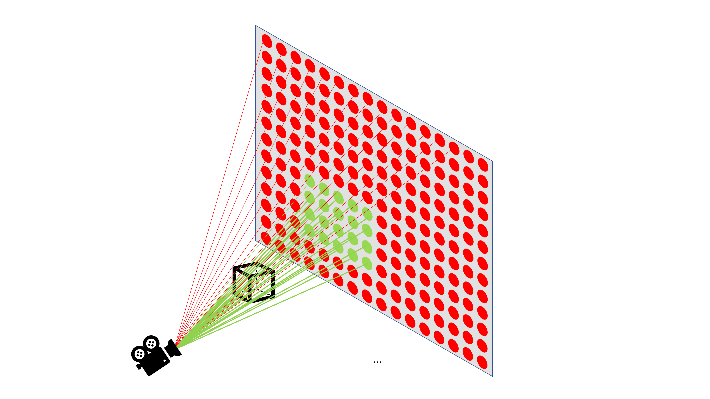
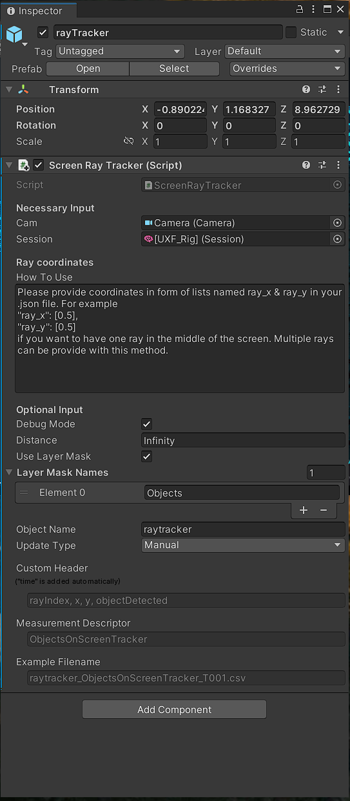

```{r setup, include=FALSE}
knitr::opts_chunk$set(echo = TRUE, message = FALSE, warning = FALSE)
```

```{r libraries}
library(knitr)
library(ggplot2)
library(plyr)
```

# Main idea behind this tool
For the type of memory experiments using virtual reality (VR) that I ran during my PhD I would have loved to use eye tracking to ascertain that the objects that my participants encountered during these tasks were actually seen. Unfortunately, I did not have access to a head mounted display that also allows eye tracking at the same time. So I thought about the second best thing because I knew there must be something. One important functionality that games engines like unity usually offer is to cast rays from certain point into a certain direction to detect whether this ray hits anything. This is typically invisible to the player but is crucial for a lot of different functions (e.g. Did the player hit the enemy when they shot at them?). For me,, this functionality also offers a way to record what object appeared where on a screen at which time. Figure 1 illustrates the basic idea fo the script that is described here.


Figure 1: Illustration of the basic idea of the screen ray tracker. Note only a subset of the rays is shown here. 

Shortly put, on every frame the _screen ray tracker_ casts rays from the camera parallel to the screen projection and detects whether or not objects on so-called [layer masks](https://docs.unity3d.com/ScriptReference/LayerMask.html) are hit by the rays. If an object is hit, the ray index, the ray position as well as the name of the game object that has been hit is saved with a time-stamp. This tracker is implemented in [UXF's](https://github.com/immersivecognition/unity-experiment-framework) tracking system (see [here](https://github.com/immersivecognition/unity-experiment-framework/wiki/Tracker-system)). The user of this tool has full control where on the screen the rays will project to by providing x,y coordinates form 0 to 1 in the .json file for the UXF experiment. Now to the question, what is this useful for?


Figure 2: Screenshots of the _screen ray tracker_ with the debug mode enabled in Unity's scene view. The rays in red do not hit any object so they are also not logged. Rays that hit an object in that scene are green. In this example the floor & the walls are not part of the layer mask, which is why they are ignored in this process. 

# What is possible?
There are number of possible applications of this tool. I list only a few of them.
1. Find the first time point an object appears on the screen. 
2. Find out whether an game object ever appeared centrally on the screen.
3. If so how long? 
4. Which object stay on the screen for the longest duration? 

More specific combinations of these questions can be answered with the data that is collected. In my envisioned use-case, I would be able to verify whether an object was at any time point during the experiment visible to the participant. In naturalistic settings where the participants for instance explores an environment on their own this is not a given. However, it can be crucial if I want to explain why an object was remembered well or possibly even forgotten. The latter would be simply impossible to judge if I don't know if the object was ever visible to the participant. 

# Investigating example data
To give an example, I quickly analyse pilot data from an experiment that I started where participant have to collect diamond-shaped objects to get reward (depicted in Figure 2). 

```{r screen_tracker}
# Load the data
screenTracker <- read.csv("exampleData.csv")

# What does the data look like?
head(screenTracker)
```

Quick explanation of the columns:

 - ___time___: The time point of the log (Unity's Time.time).
 - ___rayIndex___: The ray index starting form 0 to how many rays were provided in the .json file - 1.
 - ___x___: The horizontal position on the screen (between 0 and 1).
 - ___y___: The vertical position on the screen (between 0 and 1).
 - ___objectDetected___: The name of the object as it appeared in the game view. It might therefore be important to give unique names to the objects. 

So what can I do with the data? I can for instance visualise where on the screen a certain object (e.g. a game object called Diamond 8) appeared. 

```{r where_on_screen}
# Assume 1920 x 1080 screen resolution 
screenTracker$x_pixel <- screenTracker$x*1920
screenTracker$y_pixel <- screenTracker$y*1080
  
# Where did diamond 8 appear on the screen?  
diamond8 <- screenTracker[screenTracker$objectDetected == 'diamond8', ]

# Plot
ggplot(diamond8, aes(x = x_pixel, y = y_pixel)) +  
  geom_count() +
  labs(title = "Where on the screen was Diamond 8?", x = "x pixel", y = "y pixel")
```

Since, the camera's x and z-rotation is fixed in this experiment the observed pattern is pretty reasonable as the game object called Diamond 8 mostly appeared in the middle strip of the screen. Only when this object was collected, other parts of the screen like the corners were filled with the object.  

Another thing I can visualise is how many time points (not time duration) each object was on the screen and plot that distribution. 

```{r screen_tracker_earliest_time_point, fig.height = 8, fig.width = 6}
# For each object get each time point it was somewhere on the screen
timeOnScreen <- ddply(screenTracker, c("objectDetected", "time"), summarise, samples = length(time))

# Now aggregate across time points
timeOnScreen <- ddply(timeOnScreen, c("objectDetected"), summarise, timePoints = length(time))

# Sort objectDetected by timePoints
timeOnScreen$objectDetected <- factor(timeOnScreen$objectDetected, 
                                       labels = timeOnScreen$objectDetected, 
                                       levels = timeOnScreen$objectDetected[order(timeOnScreen$timePoints)]) 

# Plot
ggplot(timeOnScreen, aes(x = timePoints, y = objectDetected)) + 
  geom_bar(stat = "identity", width = 0.5) +
  theme(axis.text.y = element_text(size = 6)) +
  labs(title = "Objects sorted by number time points on the screen", x = "Time points", y = "Object")
```

Based on this distribution we learn that Icosahedron 9 is the object that was on the screen for the highest number of time points. A more specific question for naturalistic experiments could be more targeted and ask when is the first time this object appeared on the screen? 

```{r first_time}
# Find the first time icosahedron9 was on the screen.
firstTime <- round(min(screenTracker$time[screenTracker$objectDetected == 'icosahedron9']))
```

In this case, the answer is that Icosahedron 9, it first appeared on the screen on second `r firstTime`. These are obviously only examples and many more things can be assessed with this data. 

# How to configure the script so it can be used?
Now, to the more technical bit on how to use this script with Unity (I currently use Unity 2021.3.1f1c1) and UXF (version 2.4.3). Instructions are from the script itself:

> Attach this component to any game object (e.g. an empty one) and assign it to the correct field. It is called Tracked Objects. You can find this on the _Session (Script)_ attached to the _[UXF_Rig]_ game object under _Data collection_ tab. Just drag & drop your ray casting game object on to the field. Furthermore, you have to add three methods of the _Screen Ray Tracker (Script)_ to  events that can be found undder the _Events_ tab on the same _Session (Script)_. In particular, you need to add _GetRayCoordinates_ to _On Session Beginn_. For _On Trail Begin_, you have add _StartRecording_ and _StopRecording_ has logically be added to _On Trial End_. This controls the recording, which is important as we will have choose the manual recording mode for this tracker. 

> In the inspector under _Necessary Input_ you have to add the camera from which you want to cast the rays and the _[UXF_Rig]_. Also, you need to make sure that the _Update Type_ below is set to _Manual_ (see Figure 3).

> The last thing that has to be provided are the ray coordinates, which are added to the .json file that is read in at the beginning of the sessiono of your experiment. This .json file can for instance look like this

```{json}
{
"ray_x": [0.5],
"ray_y": [0.5]
}
```

> if you only want one ray in the middle. The only important thing here is that you have to provide input in form of _ray_x_ and _ray_y_. Then you're good to go.

> _Optional Input_ include the ability to activate _Debug mode_, which will print each hit to the console and visualise your rays, _Distance_ (i.e. how far the ray is cast), which by the default is set to infinity but can be changed to a different value and importantly you can also provide _Layer Mask Names_ if you want to organise your objects on those and only some of them should be detectabe by the rays. 




Figure 3: Inspector view of the script.

# A word on peformance

I have not done a lot of performance testing yet but I have not seen much of the performance decrease even if I cast 100 rays at once but further testing might be worthwhile. Depending on how long a trial is, it is possible that saving the tracking data at the end can take some time. 
